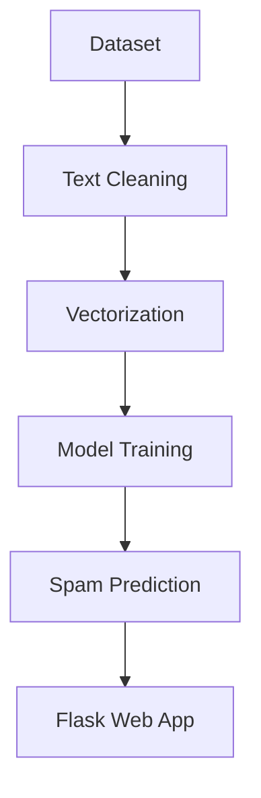

# 🚀 Spam Classifier

<div align="center">


### 📩 AI-Powered Spam Message Classifier

Detect whether a message is **Spam** or **Not Spam** using Machine Learning.

🌐 **Live Demo:** [https://spam-classifier-u93q.onrender.com](https://spam-classifier-u93q.onrender.com)

</div>

---

# ✨ Features

✅ Detect Spam & Ham Messages
✅ Interactive Web Interface
✅ Machine Learning Based Prediction
✅ Fast & Lightweight
✅ Easy Deployment with Render
✅ Beginner Friendly Project Structure

---

# 🖥️ Live Demo

🔗 **Try the App Here:**
[https://spam-classifier-u93q.onrender.com](https://spam-classifier-u93q.onrender.com)

---

# 📸 Preview

> Add screenshots of your application here.

Example:

```md

```

---

# 🧠 Tech Stack

| Technology   | Usage                  |
| ------------ | ---------------------- |
| Python       | Core Programming       |
| Flask        | Backend Framework      |
| Scikit-learn | Machine Learning Model |
| HTML/CSS     | Frontend               |
| Pickle       | Model Serialization    |
| Render       | Deployment             |

---

# 📂 Project Structure

```bash
Spam-Classifier/
│
├── static/                 # CSS / Static Files
├── templates/              # HTML Templates
├── spam.csv                # Dataset
├── model.pkl               # Trained Model
├── vectorizer.pkl          # Text Vectorizer
├── app.py                  # Flask Application
├── train_model.py          # Model Training Script
├── requirements.txt        # Dependencies
└── README.md               # Project Documentation
```

---

# ⚙️ Installation & Setup

## 1️⃣ Clone the Repository

```bash
git clone https://github.com/anisha-1811/Spam-Classifier.git
cd Spam-Classifier
```

---

## 2️⃣ Create Virtual Environment

### Windows

```bash
python -m venv venv
venv\Scripts\activate
```

### Mac/Linux

```bash
python3 -m venv venv
source venv/bin/activate
```

---

## 3️⃣ Install Dependencies

```bash
pip install -r requirements.txt
```

---

## 4️⃣ Run the Application

```bash
python app.py
```

---

# 🌍 Open in Browser

```bash
http://127.0.0.1:5000
```

---

# 🧪 Example Test Messages

## Spam Example

```text
Congratulations! You've won a FREE iPhone. Click here now!
```

## Not Spam Example

```text
Hey, are we meeting tomorrow for the project discussion?
```

---

# 📈 Machine Learning Workflow



---

# 🚀 Deployment

This project is deployed on **Render**.

### Deployment Steps

```bash
1. Push project to GitHub
2. Connect GitHub repo to Render
3. Add build command:
   pip install -r requirements.txt
4. Add start command:
   python app.py
5. Deploy 🚀
```

---

# 🤝 Contributing

Contributions are welcome!

## Steps to Contribute

```bash
1. Fork the repository
2. Create a new branch
3. Make changes
4. Commit your changes
5. Push to your branch
6. Open a Pull Request
```

---

# ⭐ Support

If you like this project:

🌟 Star the repository
🍴 Fork the project
📢 Share it with others

---

# 👩‍💻 Author

### Anisha

🔗 GitHub: [https://github.com/anisha-1811](https://github.com/anisha-1811)

---

# 📜 License

This project is open-source and available under the **MIT License**.

---

<div align="center">

## 💡 Made with ❤️ using Machine Learning

</div>
